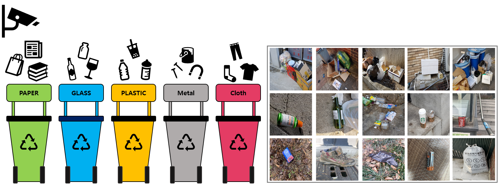
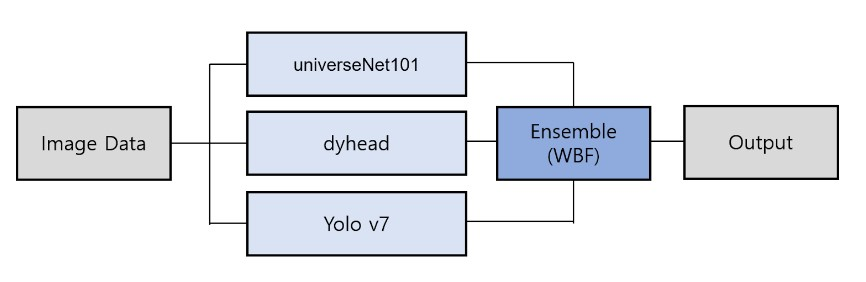

## 🌏Overview

우리는 많은 물건이 대량으로 생산되고, 소비되는 시대를 살고 있다. 이러한 문화는 '쓰레기 대란', '매립지 부족'과 같은 여러 사회 문제를 발생시킨다. 그렇기 때문에 올바른 분리수거로 환경 부담을 줄일 필요가 있다. 잘 분리배출 된 쓰레기는 자원으로서 가치를 인정받아 재활용될 수 있기 때문이다. 하지만 잘못 분리배출 되면 그대로 폐기물로 분류되어 매립 또는 소각된다. 따라서 우리는 사진에서 쓰레기를 Detection 하는 모델을 만들어 이러한 문제점을 해결해보고자 한다.

## 🧙‍♂️Team

|                                                                           김지현                                                                           |                                                                           박상필                                                                           |                                                                           오동혁                                                                           |                                                                           이상민                                                                           |                                                                           이태순                                                                           |
| :--------------------------------------------------------------------------------------------------------------------------------------------------------: | :--------------------------------------------------------------------------------------------------------------------------------------------------------: | :--------------------------------------------------------------------------------------------------------------------------------------------------------: | :--------------------------------------------------------------------------------------------------------------------------------------------------------: | :--------------------------------------------------------------------------------------------------------------------------------------------------------: |
|  |  |  |  |  |

## 🏆LB Score

- private : 0.6834 (7등 / 19팀)
- public : 0.6639 (8등 / 19팀)

## ⭐Project Summary

- EDA: EDA를 통해 작은 박스가 많이 분포 , class imbalance 문제 등 데이터의 특징을 알아내고 문제에 따른 전략 수립
- Validation set 구성: strarified k-fold를 이용해 validation set을 신속하게 구축
- data 시각화: data시각화를 통해 모델의 예측 성능 파악
- 다양한 SOTA 모델 실험: UniverseNet, dyhead, yolov7, yolo5, focalNet 등 다양한 SOTA 모델에 대해 실험을 진행
- TTA : multi scaling, flip
- Ensemble : 중복된 box는 WBF(weighted box fusion)을 이용해서 처리

## 📈Model performance

|       model        |  backbone  | LeaderBoard mAP |
| :----------------: | :--------: | :-------------: |
|     **dyhead**     | **swin-l** |   **0.6558**    |
| **universeNet101** |   **??**   |   **0.6330**    |
|    **Yolo v7**     |   **??**   |   **0.5570**    |
|        ATSS        |   swin-b   |     0.5876      |
|    cascade_RCNN    |   swin-b   |     0.5730      |
|  deformable DETR   |   swin-t   |     0.5262      |
|     Yolo v5x6      |     ??     |     0.5538      |
|      yolo v7x      |     ??     |     0.4257      |
|      FocalNet      |     ??     |     0.5065      |

## 💾Datasets

- train 이미지 갯수 : 4883장
- test 이미지 갯수 : 4871장
- class : General trash, Paper, Paper pack, Metal, Glass, Plastic, Styrofoam, Plastic bag, Battery, Clothing
- 이미지 크기 : (1024, 1024)
- 출처 : 부스트캠프 AI Tech

## 📊Metric

- mAP50(Mean Average Precision)
  - Object Detection에서 사용하는 대표적인 성능 측정 방법
  - Ground Truth 박스와 Prediction 박스간 IoU(Intersection Over Union, Detector의 정확도를 평가하는 지표)가 50이 넘는 예측에 대해 True라고 판단

## ⚒Development Environment

- GPU : v100
- OS : linux
- library : mmdetection, pytorch
